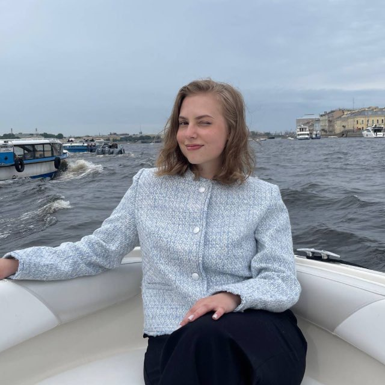

# Обо мне

Я работаю администратором проектов в IT-департаменте крупной нефтегазовой компании.

*А это я⬆️*

## Опыт работы

| Компания | Должность | Период | Основные задачи |
| :--- | :--- | :--- | :--- |
| Университет ИТМО | Сотрудник Приемной комиссии | лето 2023, лето 2024 | Проверка документов и достижений абитуриентов, общение с абитуриентами |
| Университет ИТМО | Менеджер по маркетингу | 2024-2025 | Создание текстового и визуального контента для соц.сетей Магистратуры ИТМО, организация образовательных мероприятий, сбор семантики и ВК- и ТГ-сообществ для рекламы |
| Газпромнефть-ЦР | Web-разработчик | 2025 - н.в. | Контроль ведения проекта и разработки продукта, планирование и ведение бюджета проекта, подготовка проектной документации и отчетности по проекту, организация коммуникаций в проекте |

## Навыки

*   Управление проектами
*   Бизнес-анализ
*   SQL и статистический анализ 
*   Английский язык C1

## Образование

 **Университет ИТМО:**
 Факультет технологического менеджмента и инноваций, 2021-2025.
 Специальность: "Инноватика".

## Хобби и увлечения

*   **Спорт.** Хожу в зал в свободное время.
*   **Музыка.** Люблю петь и слушать музыку.
*   **Хайкинг.** Люблю проводить время на природе.
