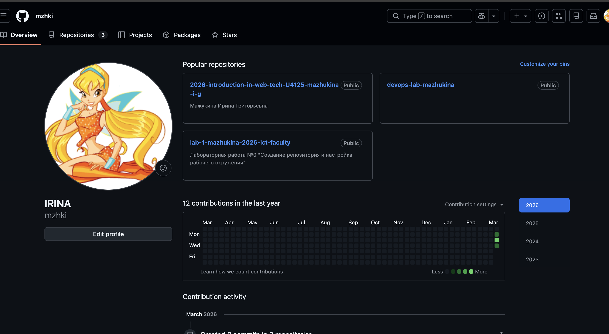
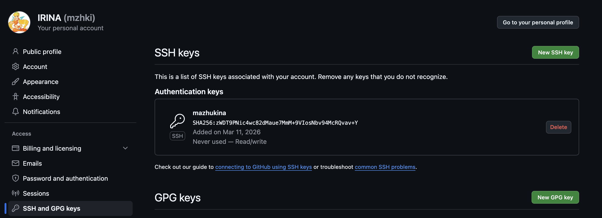
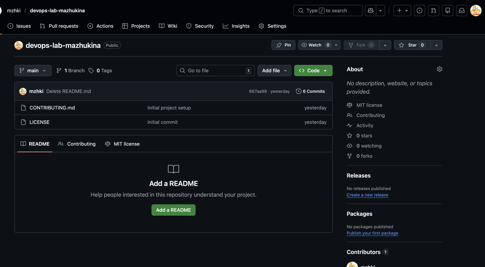
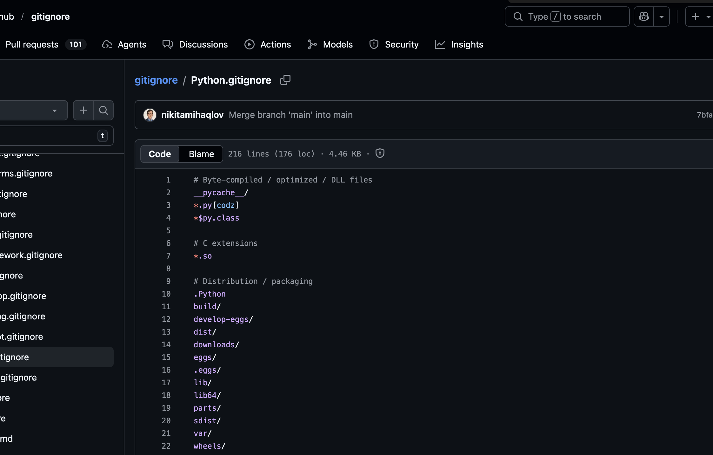
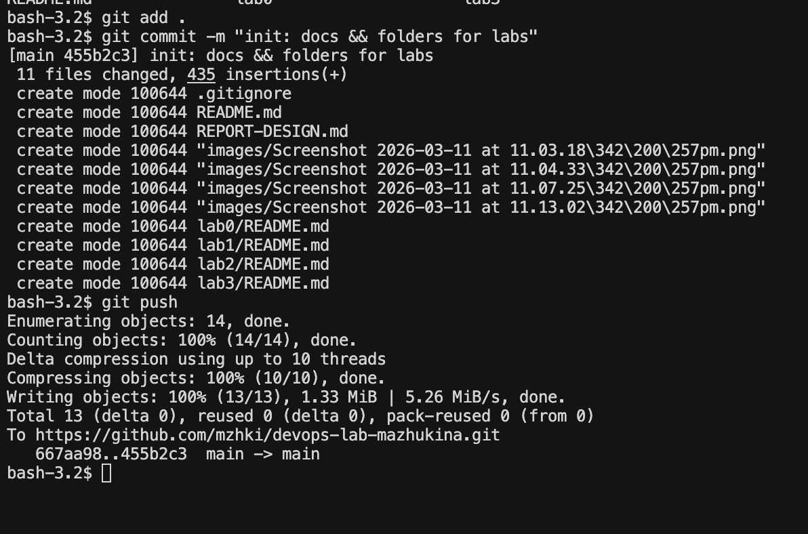
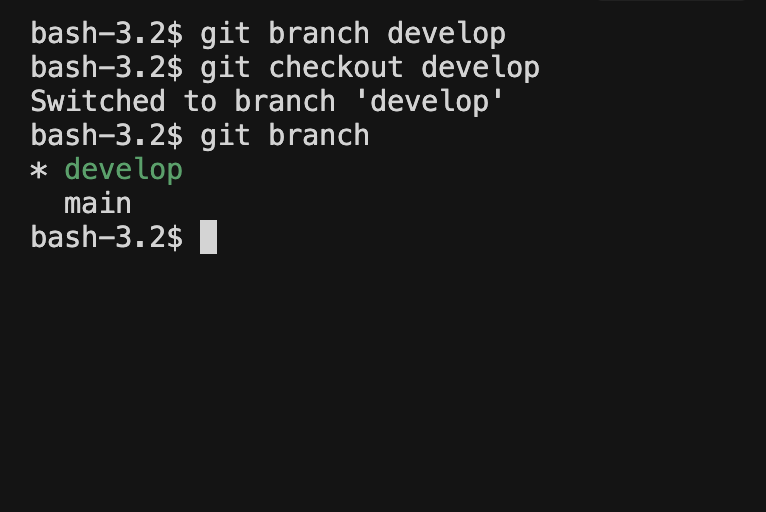

# Лабораторная работа №0
## «Создание репозитория и настройка рабочего окружения»

---

| Поле | Значение |
|---|---|
| **University** | [ITMO University](https://itmo.ru/ru/) |
| **Faculty** | [FICT](https://fict.itmo.ru) |
| **Course** | [Введение в веб технологии](https://itmo-ict-faculty.github.io/introduction-in-web-tech/) |
| **Year** | 2025/2026 |
| **Group** | K66666 |
| **Author** | Мажукина Ирина |
| **Lab** | Lab0 |
| **Date of create** | 11.03.2026 |
| **Date of finished** | — |

---

## Описание

Это вводная лабораторная работа по созданию репозитория и настройке рабочего окружения для изучения DevOps-практик. В ходе работы я впервые познакомилась с системой контроля версий Git, платформой GitHub и базовыми инструментами, которые используют разработчики и DevOps-инженеры в повседневной работе.

---

## Цель работы

Научиться создавать репозитории, настраивать рабочее окружение и изучить основы работы с Git и GitHub.

---

## Правила оформления

Правила оформления отчёта по лабораторной работе можно изучить по [ссылке](https://itmo-ict-faculty.github.io/introduction-in-web-tech/).

---

## Ход работы

### 1. Создание аккаунта на GitHub и настройка SSH-ключей ✅

Создала аккаунт на платформе GitHub по адресу: **https://github.com/mzhki**

> **Скриншот:** профиль на GitHub после регистрации



---

Для безопасной работы с репозиторием на персональном устройстве был создан SSH-ключ с помощью команды `ssh-keygen`:

```bash
ssh-keygen -t ed25519 -C "mazukinaira@gmail.com"
```

Публичный ключ был добавлен в настройки GitHub-аккаунта:

```
cat ~/.ssh/id_ed25519-mazhukina.pub
ssh-ed25519 AAAAC3NzaC1lZDI1NTE5AAAAIGJmXckW4aRvFmdnj3QL/GNpcLrggtT6u7BabnLDuCwi mazukinaira@gmail.com
```

> **Скриншот:** добавленный SSH-ключ в настройках GitHub



---

### 2. Создание репозитория ✅

Создан новый репозиторий с названием **devops-lab-mazhukina** на GitHub.

> **Скриншот:** созданный репозиторий на GitHub



---

### 3. Клонирование репозитория на компьютер ✅

Репозиторий был склонирован на локальный компьютер с помощью команды `git clone`:

```bash
git clone https://github.com/mzhki/devops-lab-mazhukina.git
```

Вывод команды в терминале:

```
Cloning into 'devops-lab-mazhukina'...
remote: Enumerating objects: 16, done.
remote: Counting objects: 100% (16/16), done.
remote: Compressing objects: 100% (14/14), done.
remote: Total 16 (delta 5), reused 6 (delta 1), pack-reused 0 (from 0)
Receiving objects: 100% (16/16), 5.58 KiB | 2.79 MiB/s, done.
Resolving deltas: 100% (5/5), done.
```

После этого репозиторий появился на компьютере в виде обычной папки, с которой теперь можно работать.

---

### 4. Создание файла README.md ✅

Создан файл `README.md` с описанием проекта и контактными данными.

**Немного о себе:**

Я — Ирина Мажукина, учусь на Факультете Менеджмента и Инноваций по направлению «Управление высокотехнологичным бизнесом». Параллельно с учёбой работаю проджект-менеджером.

Мне всегда было интересно, как работают IT-специалисты, особенно в области DevOps. Именно поэтому в этом семестре (2026 год) я выбрала это направление для изучения. Хочу лучше понимать, что происходит «под капотом» у технических команд, с которыми я работаю как менеджер.

---

### 5. Создание файла .gitignore ✅

Создан файл `.gitignore`, который указывает Git, какие файлы **не нужно** сохранять в историю изменений (временные файлы, кэш, системный мусор и т.д.).

Шаблон был взят из официального репозитория GitHub: **https://github.com/github/gitignore**

Был выбран шаблон для **Python**, так как предполагается, что лабораторные работы будут связаны с Python. Если в процессе работы окажется, что нужно исключить дополнительные файлы — `.gitignore` будет обновляться.

> **Скриншот:** содержимое файла `.gitignore` в репозитории



---

Перед переходом в ветку `develop` был сделан первоначальный коммит в ветку `main` для фиксации базового состояния проекта.

> **Скриншот:** первый коммит в ветку main



---

### 6. Создание ветки develop и переключение на неё ✅

Создана отдельная ветка `develop` для дальнейшей разработки. Это стандартная практика в Git: в `main` хранится стабильная версия, а вся работа ведётся в отдельных ветках.

Команды для создания и переключения на ветку:

```bash
git branch develop
git checkout develop
```

> **Скриншот:** переключение на ветку develop в терминале



---

### 7. Создание файла CONTRIBUTING.md ✅

Создан файл `CONTRIBUTING.md` — это стандартный файл в репозитории, который объясняет правила участия в проекте: как правильно делать коммиты, как называть ветки, как оформлять Pull Request.

Содержимое файла описывает соглашения, принятые в данном репозитории для лабораторных работ.

---

### 8. Коммит и отправка изменений ✅

После завершения работы в ветке `develop` все изменения были зафиксированы и отправлены в удалённый репозиторий на GitHub.

Команды для коммита и отправки:

```bash
git add .
git commit -m "Initial project setup"
git push origin develop
```

> *Скриншот: добавить скриншот с терминалом после выполнения git push*

---

### 9. Создание Pull Request из develop в main ⏳

> *Будет выполнено на следующем шаге.*

Вот этот файл в images

lab0-create-pull-request.png


---

### 10. Merge Pull Request и удаление ветки develop ⏳

> *Будет выполнено после создания Pull Request.*

---

## Результаты лабораторной работы

В результате данной работы должно быть:

- [x] Создан аккаунт на GitHub
- [x] Настроены SSH-ключи для безопасной работы
- [x] Создан репозиторий на GitHub
- [x] Склонирован репозиторий на локальный компьютер
- [x] Создан файл `README.md` с описанием проекта
- [x] Создан файл `.gitignore` с настройками исключений
- [x] Создана ветка `develop`
- [x] Создан файл `CONTRIBUTING.md`
- [x] Выполнен коммит и push изменений
- [ ] Создан и смержен Pull Request

---

## Полезные ссылки

| Ресурс | Ссылка |
|---|---|
| Создание SSH-ключей для GitHub | [Документация GitHub](https://docs.github.com/en/authentication/connecting-to-github-with-ssh) |
| Основы Git | [Git Book (на русском)](https://git-scm.com/book/ru/v2) |
| GitHub Flow | [Guides](https://guides.github.com/introduction/flow/) |
| Шаблоны .gitignore | [github/gitignore](https://github.com/github/gitignore) |
