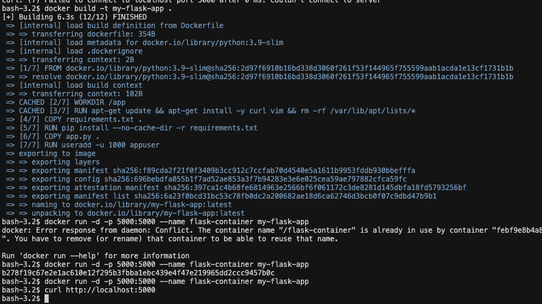
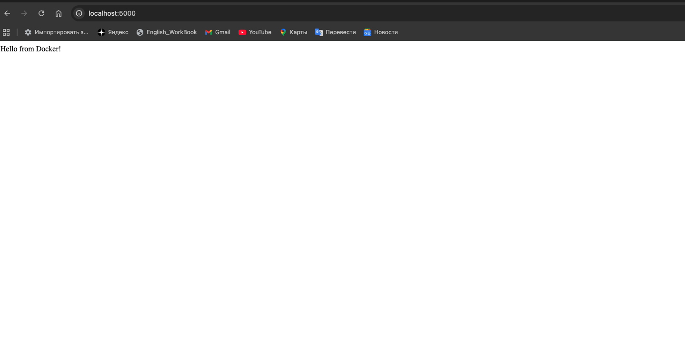

# Лабораторная работа №1
## «Основы работы с Docker»

---

| Поле | Значение |
|---|---|
| **University** | [ITMO University](https://itmo.ru/ru/) |
| **Faculty** | [FTMI](https://ftmi.itmo.ru/) |
| **Course** | [Введение в веб технологии](https://itmo-ict-faculty.github.io/introduction-in-web-tech/) |
| **Year** | 2025/2026 |
| **Group** | U4125 |
| **Author** | Мажукина Ирина |
| **Lab** | Lab1 |
| **Date of create** | 11.03.2026 |
| **Date of finished** | 11.03.2026 |

---

## Описание

Эта лабораторная работа посвящена Docker — инструменту, который позволяет «упаковывать» программы вместе со всем необходимым окружением и запускать их в изолированных контейнерах. До этого я вообще не понимала, что это такое и зачем нужно. После выполнения работы стало гораздо понятнее, почему разработчики и DevOps-инженеры так активно его используют.

---

## Цель работы

Установить Docker, научиться запускать готовые контейнеры и создать собственный образ с Flask-приложением по заданным требованиям.

---

## Правила оформления

Правила оформления отчёта по лабораторной работе можно изучить по [ссылке](https://itmo-ict-faculty.github.io/introduction-in-web-tech/).

---

## Что такое Docker — простыми словами

Прежде чем начать, я попыталась разобраться, что вообще такое Docker.

Представьте, что вы готовите блюдо и хотите, чтобы оно получилось одинаково у всех — дома, у подруги, в ресторане. Docker делает именно это, но для программ: он упаковывает программу вместе со всеми её «ингредиентами» (библиотеками, настройками) в одну коробку — **контейнер**. Эта коробка запускается одинаково на любом компьютере.

Основные понятия:
- **Образ (image)** — это как рецепт или шаблон. Из одного образа можно создать много контейнеров.
- **Контейнер (container)** — это запущенная программа, изолированная от всего остального на компьютере.
- **Dockerfile** — текстовый файл с инструкциями, как собрать образ (как написать рецепт).

---

## Ход работы

### Часть 1. Обязательное задание

### 1. Установка Docker 

Скачала Docker Desktop с официального сайта для macOS:
**https://docs.docker.com/desktop/setup/install/mac-install/**

Важный момент, который я поняла не сразу: нужно не просто установить Docker, но и **запустить приложение Docker Desktop**. Без этого все команды в терминале будут выдавать ошибку, потому что Docker daemon (фоновая служба) не работает.

Проверила установку командой:

```bash
docker -v
```

```
Docker version 29.3.0, build 5927d80c76
```

Запустила тестовый контейнер `hello-world` — это стандартная проверка, что всё работает:

```bash
docker run hello-world
```

> **Скриншот:** вывод `docker run hello-world` — Docker скачал образ и запустил контейнер с приветственным сообщением


---

### 2. Базовые команды Docker 

Изучила основные команды. Объясню их простыми словами, как я их поняла:

| Команда | Что делает |
|---|---|
| `docker images` | Показывает список всех образов, которые уже скачаны на компьютер — как список приложений в папке |
| `docker ps` | Показывает только **сейчас работающие** контейнеры — как диспетчер задач, но только для Docker |
| `docker ps -a` | Показывает **все** контейнеры — и работающие, и уже остановленные |

> **Скриншот:** выполнение базовых команд в терминале


---

### 3. Работа с готовыми образами 

Скачала готовый образ Ubuntu (это операционная система Linux) и запустила его как контейнер. Внутри этого контейнера — как будто отдельный маленький компьютер с Linux:

```bash
docker pull ubuntu:latest
docker run -it ubuntu bash
```

Флаг `-it` означает «интерактивный режим» — я попала внутрь контейнера и могла вводить команды. Установила внутри пакет `curl` (программа для отправки запросов в интернет):

```bash
apt update && apt install -y curl
```

> **Скриншот:** установка curl внутри контейнера Ubuntu


Проверила, что curl установился, и вышла из контейнера:

```bash
curl --version
exit
```

> **Скриншот:** вывод версии curl и выход из контейнера


---

### 4. Запуск веб-сервера nginx 

Запустила готовый веб-сервер nginx в контейнере. Флаг `-d` означает, что контейнер работает в фоне (я продолжаю использовать терминал), а `-p 8080:80` — это проброс порта: обращения к моему компьютеру на порт 8080 перенаправляются на порт 80 внутри контейнера.

```bash
docker run -d -p 8080:80 --name web-server nginx:alpine
```

> **Скриншот:** запуск контейнера nginx


Открыла браузер и зашла на `http://localhost:8080` — увидела стандартную страницу nginx. Это значит, что веб-сервер работает прямо внутри контейнера, а я открываю его через браузер:

> **Скриншот:** страница nginx в браузере


Посмотрела логи контейнера — там видны все обращения к серверу:

```bash
docker logs web-server
```

> **Скриншот:** логи контейнера


Подключилась к запущенному контейнеру изнутри:

```bash
docker exec -it web-server sh
```

> **Скриншот:** подключение к контейнеру через exec


---

### 5. Управление контейнерами ✅

Изучила команды для управления контейнерами. По сути это как кнопки «пауза», «стоп» и «удалить» для запущенных программ:

| Команда | Что делает |
|---|---|
| `docker stop web-server` | Останавливает работающий контейнер (программа перестаёт работать, но не удаляется) |
| `docker start web-server` | Снова запускает остановленный контейнер |
| `docker rm web-server` | Полностью удаляет контейнер (сначала нужно остановить) |
| `docker rmi nginx:alpine` | Удаляет образ с компьютера (освобождает место на диске) |

---

### 6. Работа с томами (volumes) 

Тома решают важную проблему: по умолчанию все данные внутри контейнера **исчезают** при его удалении. Том — это специальная папка вне контейнера, которая подключается к нему. Данные в этой папке остаются, даже если контейнер удалить.

```bash
docker volume create my-volume
docker run -it --name volume-test -d -v my-volume:/data ubuntu bash
docker exec -it volume-test bash
echo "Hello from volume" > /data/test.txt
```

Удалила контейнер, создала новый с тем же томом — файл `test.txt` на месте. Это подтвердило, что данные хранятся в томе, а не внутри контейнера.

---

### Часть 2. Задание со звёздочкой — создание собственного Dockerfile

### 7. Создание Flask-приложения и Dockerfile 

Это была самая сложная часть для меня как для человека без технического бэкграунда. Flask — это фреймворк на Python для создания веб-приложений. Задача была создать простое приложение и «упаковать» его в Docker-контейнер с помощью Dockerfile.

Все файлы проекта находятся в папке [`lab1-flask-app/`](./lab1-flask-app/).

**Структура проекта:**

```
lab1-flask-app/
├── app.py            # Само веб-приложение на Python
├── requirements.txt  # Список библиотек, которые нужны приложению
└── Dockerfile        # Инструкция: как собрать Docker-образ
```

---

**`app.py`** — простое веб-приложение. При обращении к корневому адресу (`/`) оно возвращает текст «Hello from Docker!»:

```python
from flask import Flask

app = Flask(__name__)

@app.route('/')
def hello():
    return "Hello from Docker!"

if __name__ == '__main__':
    app.run(host='0.0.0.0', port=5000)
```

---

**`requirements.txt`** — список Python-библиотек, которые нужно установить. `Werkzeug` — это зависимость Flask, её версию тоже пришлось зафиксировать (об этом ниже):

```
Flask==2.0.1
Werkzeug==2.0.3
```

---

**`Dockerfile`** — пошаговая инструкция для сборки образа. Объясню каждую строку:

```dockerfile
# Берём готовый образ Python как основу (лёгкая версия)
FROM python:3.9-slim

# Устанавливаем рабочую папку внутри контейнера
WORKDIR /app

# Устанавливаем системные утилиты curl и vim
RUN apt-get update && apt-get install -y curl vim && rm -rf /var/lib/apt/lists/*

# Копируем файл зависимостей и устанавливаем их
COPY requirements.txt .
RUN pip install --no-cache-dir -r requirements.txt

# Копируем само приложение
COPY app.py .

# Создаём отдельного пользователя (не root) для безопасности
RUN useradd -u 1000 appuser
USER appuser

# Открываем порт 5000
EXPOSE 5000

# Устанавливаем переменную окружения
ENV FLASK_ENV=production

# Команда запуска приложения
CMD ["python", "app.py"]
```

---

### Проблема при первом запуске и её решение

При первой попытке запустить контейнер получила ошибку:

```
ImportError: cannot import name 'url_quote' from 'werkzeug.urls'
```

Честно говоря, я не сразу поняла, в чём дело. Оказалось, что `Flask==2.0.1` написан под старую версию библиотеки `Werkzeug`, а pip автоматически установил новую, в которой убрали функцию `url_quote`. Решение — явно указать совместимую версию Werkzeug в `requirements.txt`:

```
Flask==2.0.1
Werkzeug==2.0.3
```

После этого пересобрала образ, и всё заработало. Это хороший урок: в разработке важно фиксировать версии всех зависимостей, иначе при обновлении библиотек всё может сломаться.

---

**Сборка образа и запуск контейнера:**

```bash
docker build -t my-flask-app .
docker run -d -p 5000:5000 --name flask-container my-flask-app
```

> **Скриншот:** сборка образа и запуск контейнера



**Проверка работы в браузере по адресу `http://localhost:5000`:**

> **Скриншот:** Flask-приложение работает в браузере



---

## Результаты лабораторной работы

В результате данной работы было выполнено:

- [x] Установлен и настроен Docker Desktop
- [x] Изучены основные команды Docker (`images`, `ps`, `run`, `stop`, `rm`, `rmi`)
- [x] Запущены контейнеры с Ubuntu и nginx
- [x] Изучена работа с томами (volumes)
- [x] Написан Dockerfile для Flask-приложения по заданным требованиям
- [x] Столкнулась с реальной ошибкой совместимости библиотек и самостоятельно её решила
- [x] Собран Docker-образ и приложение запущено в контейнере

---

## Полезные ссылки

| Ресурс | Ссылка |
|---|---|
| Документация Docker | [docs.docker.com](https://docs.docker.com) |
| Docker Hub | [hub.docker.com](https://hub.docker.com) |
| Справочник команд Docker | [Docker CLI Reference](https://docs.docker.com/engine/reference/commandline/cli/) |
| Docker образы | [Docker Images](https://docs.docker.com/engine/reference/commandline/images/) |
| Docker контейнеры | [Docker Containers](https://docs.docker.com/engine/reference/commandline/container/) |
