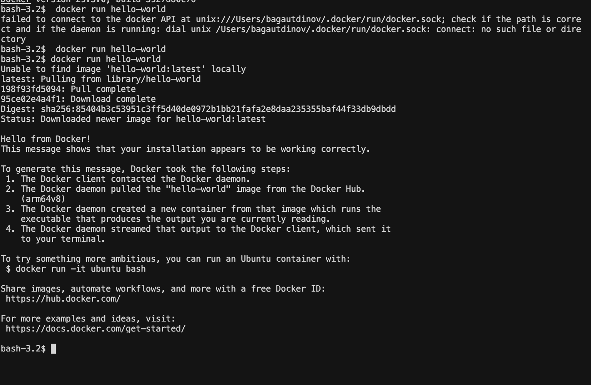
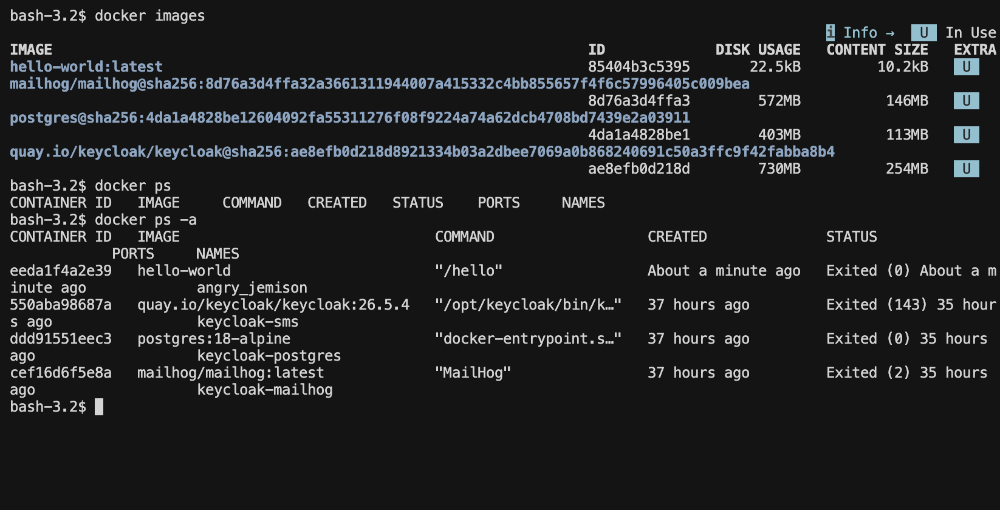
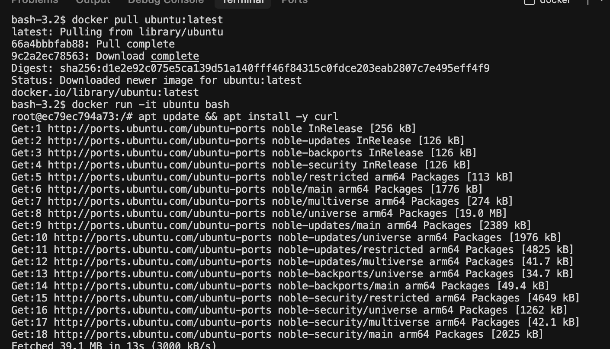
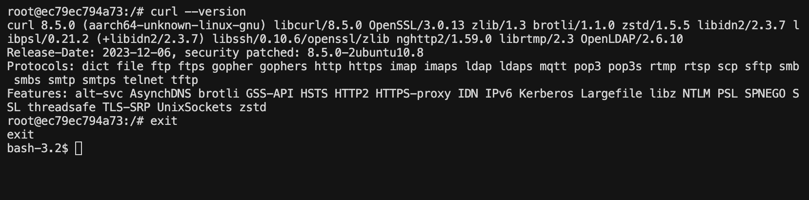
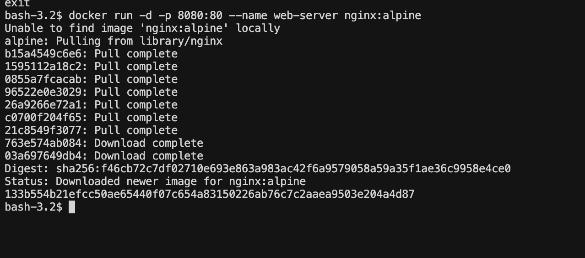
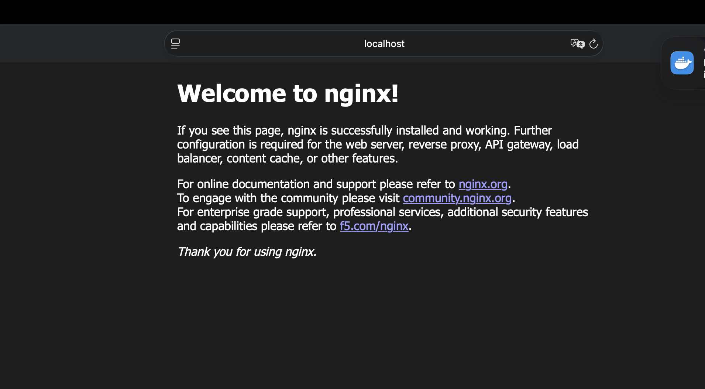
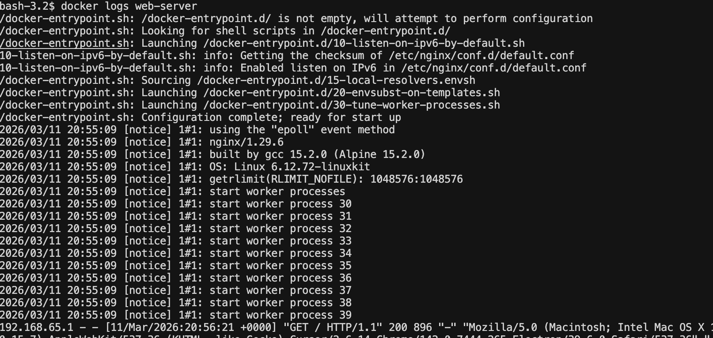
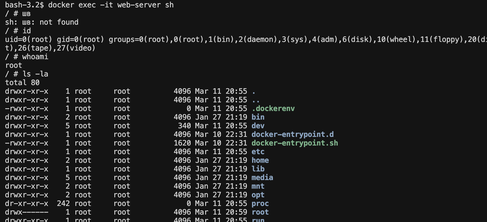

# Лабораторная работа №1
## «Основы работы с Docker»

---

| Поле | Значение |
|---|---|
| **University** | [ITMO University](https://itmo.ru/ru/) |
| **Faculty** | [FTMI](https://ftmi.itmo.ru/) |
| **Course** | [Введение в веб технологии](https://itmo-ict-faculty.github.io/introduction-in-web-tech/) |
| **Year** | 2025/2026 |
| **Group** | U4125 |
| **Author** | Мажукина Ирина |
| **Lab** | Lab1 |
| **Date of create** | 11.03.2026 |
| **Date of finished** | 11.03.2026 |

---

## Описание

Это первая лабораторная работа по изучению основ контейнеризации с использованием Docker. В ходе работы вы изучите базовые концепции Docker, научитесь создавать образы, запускать контейнеры и управлять ими.

---

## Цель работы

Научиться работать с Docker: устанавливать Docker, создавать Dockerfile, собирать образы, запускать контейнеры и управлять ими.

---

## Ход работы

### 1. Установка Docker 

Скачала Docker Desktop с официального сайта для macOS:
**https://docs.docker.com/desktop/setup/install/mac-install/**

Важный момент, который я поняла не сразу: нужно не просто установить Docker, но и **запустить приложение Docker Desktop**. Без этого все команды в терминале будут выдавать ошибку, потому что Docker daemon (фоновая служба) не работает.

Проверила установку командой:

```bash
docker -v
```

```
Docker version 29.3.0, build 5927d80c76
```

Запустила тестовый контейнер `hello-world` - это стандартная проверка, что всё работает:

```bash
docker run hello-world
```

> **Скриншот:** вывод `docker run hello-world` - Docker скачал образ и запустил контейнер с приветственным сообщением



---

### 2. Базовые команды Docker 

Изучила основные команды.

| Команда | Что делает |
|---|---|
| `docker images` | Показывает список всех образов, которые уже скачаны на компьютер - как список приложений в папке |
| `docker ps` | Показывает только **сейчас работающие** контейнеры - как диспетчер задач, но только для Docker |
| `docker ps -a` | Показывает **все** контейнеры - и работающие, и уже остановленные |

> **Скриншот:** выполнение базовых команд в терминале



---

### 3. Работа с готовыми образами 

Скачала готовый образ Ubuntu (это операционная система Linux) и запустила его как контейнер. 

```bash
docker pull ubuntu:latest
docker run -it ubuntu bash
```

Флаг `-it` означает «интерактивный режим» - я попала внутрь контейнера и могла вводить команды. Установила внутри пакет `curl` (программа для отправки запросов в интернет):

```bash
apt update && apt install -y curl
```

> **Скриншот:** установка curl внутри контейнера Ubuntu



Проверила, что curl установился, и вышла из контейнера:

```bash
curl --version
exit
```

> **Скриншот:** вывод версии curl и выход из контейнера



---

### 4. Запуск веб-сервера nginx 

Запустила готовый веб-сервер nginx в контейнере. Флаг `-d` означает, что контейнер работает в фоне (я продолжаю использовать терминал), а `-p 8080:80` - это проброс порта: обращения к моему компьютеру на порт 8080 перенаправляются на порт 80 внутри контейнера.

```bash
docker run -d -p 8080:80 --name web-server nginx:alpine
```

> **Скриншот:** запуск контейнера nginx



Открыла браузер и зашла на `http://localhost:8080` - увидела стандартную страницу nginx. Это значит, что веб-сервер работает прямо внутри контейнера, а я открываю его через браузер:

> **Скриншот:** страница nginx в браузере



Посмотрела логи контейнера - там видны все обращения к серверу:

```bash
docker logs web-server
```

> **Скриншот:** логи контейнера



Подключилась к запущенному контейнеру изнутри:

```bash
docker exec -it web-server sh
```

> **Скриншот:** подключение к контейнеру через exec



---

### 5. Управление контейнерами 

Изучила команды для управления контейнерами. По сути это как кнопки «пауза», «стоп» и «удалить» для запущенных программ:

| Команда | Что делает |
|---|---|
| `docker stop web-server` | Останавливает работающий контейнер (программа перестаёт работать, но не удаляется) |
| `docker start web-server` | Снова запускает остановленный контейнер |
| `docker rm web-server` | Полностью удаляет контейнер (сначала нужно остановить) |
| `docker rmi nginx:alpine` | Удаляет образ с компьютера (освобождает место на диске) |

---

### 6. Работа с томами (volumes) 

Тома решают важную проблему: по умолчанию все данные внутри контейнера **исчезают** при его удалении. Том - это специальная папка вне контейнера, которая подключается к нему. Данные в этой папке остаются, даже если контейнер удалить.

```bash
docker volume create my-volume
docker run -it --name volume-test -d -v my-volume:/data ubuntu bash
docker exec -it volume-test bash
echo "Hello from volume" > /data/test.txt
```

Удалила контейнер, создала новый с тем же томом - файл `test.txt` на месте. Это подтвердило, что данные хранятся в томе, а не внутри контейнера.

## Результаты лабораторной работы

В результате данной работы было выполнено:

- [x] Установлен и настроен Docker Desktop
- [x] Изучены основные команды Docker (`images`, `ps`, `run`, `stop`, `rm`, `rmi`)
- [x] Запущены контейнеры с Ubuntu и nginx
- [x] Изучена работа с томами (volumes)

---
