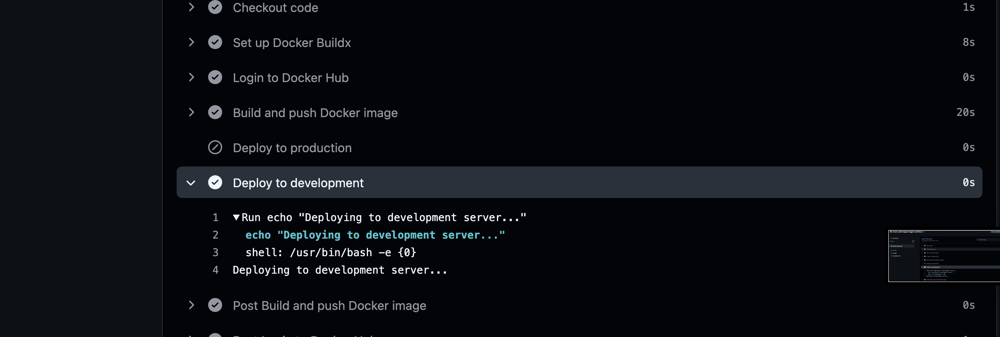
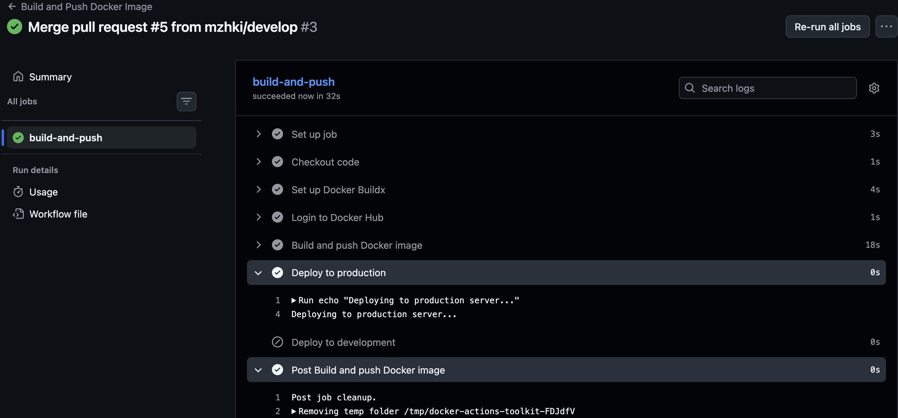

# Лабораторная работа №2
## «CI/CD для Docker приложения»

---

| Поле | Значение |
|---|---|
| **University** | [ITMO University](https://itmo.ru/ru/) |
| **Faculty** | [FICT](https://fict.itmo.ru) |
| **Course** | [Введение в веб технологии](https://itmo-ict-faculty.github.io/introduction-in-web-tech/) |
| **Year** | 2025/2026 |
| **Group** | K66666 |
| **Author** | Мажукина Ирина |
| **Lab** | Lab2 |
| **Date of create** | — |
| **Date of finished** | — |

---

## Описание

Эта лабораторная работа оказалась для меня самой непривычной, потому что здесь нужно было настроить процесс, который работает **автоматически** — без моего участия. В работе проекта я всегда отвечаю за то, чтобы процессы работали без ручного контроля. Оказывается, в разработке то же самое называется CI/CD, и это очень похоже на то, что я делаю, но только для кода.

---

## Что такое CI/CD — простыми словами

Как менеджер проекта я хорошо понимаю, как важно, чтобы изменения в работе команды проходили проверку и доставлялись вовремя. В разработке для этого используют CI/CD.

- **CI (Continuous Integration)** — «постоянная интеграция». Каждый раз, когда разработчик сохраняет изменения в коде (делает push), система автоматически собирает проект и проверяет, что ничего не сломалось. Это как обязательная проверка задачи перед тем, как поставить галочку «выполнено».

- **CD (Continuous Delivery/Deployment)** — «постоянная доставка». После успешной проверки система автоматически доставляет обновлённое приложение на сервер. Без CI/CD это делается вручную — и это медленно и с риском ошибок.

- **GitHub Actions** — встроенный инструмент GitHub, который позволяет описать все эти шаги в одном файле и запускать их автоматически.

- **Docker Hub** — это как App Store, только для Docker-образов. Туда можно загрузить свой образ, а потом скачать его на любом сервере.

---

## Цель работы

Настроить автоматический пайплайн: при каждом push в репозиторий GitHub Actions сам собирает Docker-образ из предыдущей лабораторной работы и публикует его на Docker Hub.

---

## Правила оформления

Правила оформления отчёта по лабораторной работе можно изучить по [ссылке](https://itmo-ict-faculty.github.io/introduction-in-web-tech/).

---

## Ход работы

### Часть 1. Обязательное задание

### 1. Подготовка проекта ✅

Для этой лабораторной я использую Flask-приложение, созданное в лабораторной работе №1. Оно уже лежит в папке [`lab1/lab1-flask-app/`](../lab1/lab1-flask-app/) и содержит:
- `app.py` — само приложение
- `requirements.txt` — зависимости
- `Dockerfile` — инструкция для сборки образа

---

### 2. Регистрация на Docker Hub ✅

Зарегистрировалась на [hub.docker.com](https://hub.docker.com) и создала репозиторий для образа.

Docker Hub — это публичное хранилище Docker-образов. GitHub Actions будет автоматически загружать туда собранный образ после каждого push.

> **Скриншот:** создать скриншот созданного репозитория на Docker Hub
> Сохранить как `images/lab2-dockerhub-repo.png`


---

### 3. Добавление секретов в GitHub ✅

Чтобы GitHub Actions мог войти в Docker Hub и загрузить туда образ, ему нужны логин и пароль. Хранить их прямо в коде — небезопасно (файлы видны всем). Для этого в GitHub есть «секреты» — зашифрованные переменные.

Перешла в настройки репозитория: `Settings → Secrets and variables → Actions → New repository secret`

Добавила два секрета:
- `DOCKER_USERNAME` — мой логин на Docker Hub
- `DOCKER_PASSWORD` — пароль или токен доступа к Docker Hub

> **Скриншот:** зайти в Settings → Secrets and variables → Actions и сделать скриншот со списком добавленных секретов
> Сохранить как `images/lab2-github-secrets.png`


---

### 4. Создание GitHub Actions пайплайна ✅

Создан файл `.github/workflows/docker-build.yml` — это и есть пайплайн. Файл написан на языке YAML (простой формат для описания настроек) и содержит все шаги, которые GitHub выполняет автоматически.

Объясню каждый блок:

```yaml
name: Build and Push Docker Image

# Когда запускается пайплайн: при push в ветки main или develop
on:
  push:
    branches:
      - main
      - develop

jobs:
  build-and-push:
    # На каком сервере выполняется: виртуальная машина с Ubuntu
    runs-on: ubuntu-latest

    steps:
      # Шаг 1: скачать код репозитория на виртуальную машину
      - name: Checkout code
        uses: actions/checkout@v3

      # Шаг 2: настроить Docker Buildx (улучшенный инструмент сборки)
      - name: Set up Docker Buildx
        uses: docker/setup-buildx-action@v2

      # Шаг 3: войти в Docker Hub, используя секреты из настроек репозитория
      - name: Login to Docker Hub
        uses: docker/login-action@v2
        with:
          username: ${{ secrets.DOCKER_USERNAME }}
          password: ${{ secrets.DOCKER_PASSWORD }}

      # Шаг 4: собрать образ из Dockerfile и загрузить на Docker Hub
      - name: Build and push Docker image
        uses: docker/build-push-action@v4
        with:
          context: ./lab1/lab1-flask-app
          push: true
          tags: ${{ secrets.DOCKER_USERNAME }}/my-flask-app:latest

      # Шаг 5: деплой на продакшн (только для ветки main)
      - name: Deploy to production
        if: github.ref == 'refs/heads/main'
        run: echo "Deploying to production server..."

      # Шаг 6: деплой на dev-сервер (только для ветки develop)
      - name: Deploy to development
        if: github.ref == 'refs/heads/develop'
        run: echo "Deploying to development server..."
```

---

### 5. Тестирование пайплайна ✅

Сделала коммит и push в ветку `main`. Сразу после этого в разделе `Actions` на GitHub появился запущенный пайплайн.

Поначалу было непривычно наблюдать, как GitHub сам по себе что-то делает — запускает виртуальную машину, устанавливает Docker, собирает образ. Это именно то ощущение автоматизации, о котором говорят разработчики.

> **Скриншот:** зайти на GitHub → вкладка Actions → кликнуть на запущенный workflow → сделать скриншот со списком выполненных шагов (все зелёные)
> Сохранить как `images/lab2-actions-success.png`


> **Скриншот:** зайти на Docker Hub и сделать скриншот, что образ `my-flask-app:latest` там появился
> Сохранить как `images/lab2-dockerhub-image-pushed.png`


---

### Часть 2. Задание со звёздочкой — условный деплой для разных веток

### 6. Настройка условного деплоя ✅

В пайплайн добавлено условие (`if`): в зависимости от того, в какую ветку был сделан push, выводится разное сообщение о деплое.

| Ветка | Что происходит |
|---|---|
| `main` | Сборка образа + `echo "Deploying to production server..."` |
| `develop` | Сборка образа + `echo "Deploying to development server..."` |

Это моделирует реальную практику: в `main` — стабильный продакшн, в `develop` — тестовое окружение. Образ в любом случае собирается и публикуется на Docker Hub, но «деплой» идёт в разные места.

---

### 7. Тестирование условного деплоя ✅

Сделала коммит в ветку `develop` и проверила, что в логах Actions выводится сообщение про development-сервер. Затем в ветку `main` — выводится про production.

> **Скриншот:** в GitHub Actions открыть запуск из ветки `develop`, найти шаг "Deploy to development" и сделать скриншот с его логами
> Сохранить как `images/lab2-actions-develop-deploy.png`



> **Скриншот:** то же самое для ветки `main`, шаг "Deploy to production"
> Сохранить как `images/lab2-actions-main-deploy.png`



---

## Результаты лабораторной работы

В результате данной работы было выполнено:

- [x] Зарегистрирован аккаунт на Docker Hub и создан репозиторий
- [x] Настроены секреты в GitHub репозитории
- [x] Создан файл `.github/workflows/docker-build.yml` с пайплайном
- [x] Пайплайн автоматически собирает и публикует Docker-образ при push в main
- [x] Образ успешно появляется на Docker Hub
- [x] Настроен условный деплой: разные сообщения для `main` и `develop`

---

## Полезные ссылки

| Ресурс | Ссылка |
|---|---|
| Документация GitHub Actions | [docs.github.com/actions](https://docs.github.com/en/actions) |
| Docker Hub | [hub.docker.com](https://hub.docker.com) |
| Docker Buildx | [Docker Buildx](https://docs.docker.com/buildx/working-with-buildx/) |
| GitHub Actions для Docker | [docker/build-push-action](https://github.com/docker/build-push-action) |
| Аутентификация Docker Hub | [docker/login-action](https://github.com/docker/login-action) |
