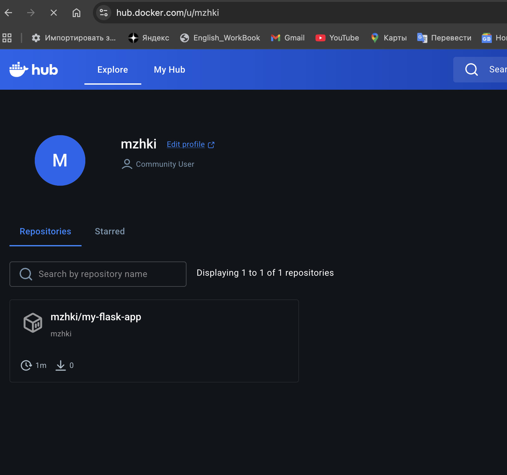
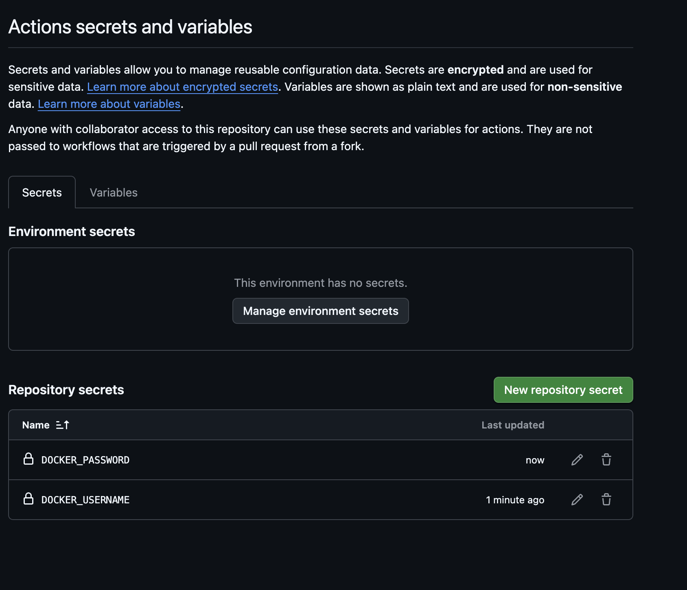
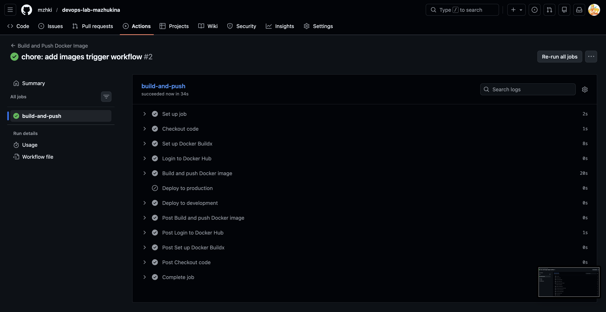
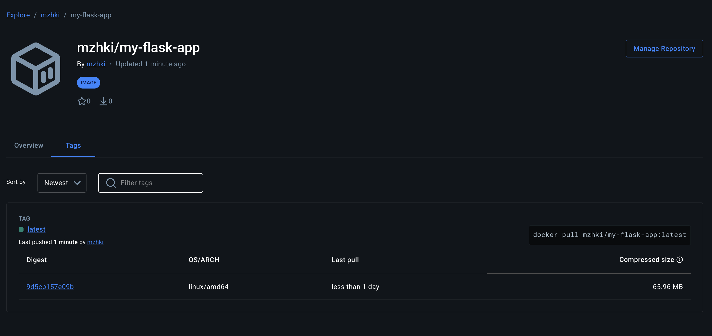

# Лабораторная работа №2
## «CI/CD для Docker приложения»

---

| Поле | Значение |
|---|---|
| **University** | [ITMO University](https://itmo.ru/ru/) |
| **Faculty** | [FTMI](https://ftmi.itmo.ru/) |
| **Course** | [Введение в веб технологии](https://itmo-ict-faculty.github.io/introduction-in-web-tech/) |
| **Year** | 2025/2026 |
| **Group** | U4125 |
| **Author** | Мажукина Ирина |
| **Lab** | Lab2 |
| **Date of create** | 11.03.2026 |
| **Date of finished** | — |

---

## Описание

Это вторая лабораторная работа по настройке CI/CD пайплайна для автоматической сборки, публикации и деплоя Docker образа из первой лабораторной работы.

---

## Что такое CI/CD — простыми словами

Как менеджер проекта я хорошо понимаю, как важно, чтобы изменения в работе команды проходили проверку и доставлялись вовремя. В разработке для этого используют CI/CD.

- **CI (Continuous Integration)** — «постоянная интеграция». Каждый раз, когда разработчик сохраняет изменения в коде (делает push), система автоматически собирает проект и проверяет, что ничего не сломалось. Это как обязательная проверка задачи перед тем, как поставить галочку «выполнено».

- **CD (Continuous Delivery/Deployment)** — «постоянная доставка». После успешной проверки система автоматически доставляет обновлённое приложение на сервер. Без CI/CD это делается вручную — и это медленно и с риском ошибок.

- **GitHub Actions** — встроенный инструмент GitHub, который позволяет описать все эти шаги в одном файле и запускать их автоматически.

---

## Цель работы

Настроить автоматический пайплайн: при каждом push в репозиторий GitHub Actions сам собирает Docker-образ из предыдущей лабораторной работы и публикует его на Docker Hub.

---

## Ход работы

### 1. Подготовка проекта 

Для этой лабораторной я использую Flask-приложение, которое лежит в папке [`lab1/lab1-flask-app/`](../lab1/lab1-flask-app/) и содержит:
- `app.py` — само приложение
- `requirements.txt` — зависимости
- `Dockerfile` — инструкция для сборки образа

---

### 2. Регистрация на Docker Hub 

Зарегистрировалась на [hub.docker.com](https://hub.docker.com) и создала репозиторий для образа.

Docker Hub — это публичное хранилище Docker-образов. GitHub Actions будет автоматически загружать туда собранный образ после каждого push.



---

### 3. Добавление секретов в GitHub 

Чтобы GitHub Actions мог войти в Docker Hub и загрузить туда образ, ему нужны логин и пароль. Хранить их прямо в коде — небезопасно (файлы видны всем). Для этого в GitHub есть «секреты» — зашифрованные переменные.

Перешла в настройки репозитория: `Settings → Secrets and variables → Actions → New repository secret`

Добавила два секрета:
- `DOCKER_USERNAME` — мой логин на Docker Hub
- `DOCKER_PASSWORD` — пароль или токен доступа к Docker Hub



---

### 4. Создание GitHub Actions пайплайна 

Создан файл `.github/workflows/docker-build.yml` — это и есть пайплайн. Файл написан на языке YAML (простой формат для описания настроек) и содержит все шаги, которые GitHub выполняет автоматически.

Объяснения по каждому блоку:

```yaml
name: Build and Push Docker Image

# Когда запускается пайплайн: при push в ветки main или develop
on:
  push:
    branches:
      - main
      - develop

jobs:
  build-and-push:
    # На каком сервере выполняется: виртуальная машина с Ubuntu
    runs-on: ubuntu-latest

    steps:
      # Шаг 1: скачать код репозитория на виртуальную машину
      - name: Checkout code
        uses: actions/checkout@v3

      # Шаг 2: настроить Docker Buildx (улучшенный инструмент сборки)
      - name: Set up Docker Buildx
        uses: docker/setup-buildx-action@v2

      # Шаг 3: войти в Docker Hub, используя секреты из настроек репозитория
      - name: Login to Docker Hub
        uses: docker/login-action@v2
        with:
          username: ${{ secrets.DOCKER_USERNAME }}
          password: ${{ secrets.DOCKER_PASSWORD }}

      # Шаг 4: собрать образ из Dockerfile и загрузить на Docker Hub
      - name: Build and push Docker image
        uses: docker/build-push-action@v4
        with:
          context: ./lab1/lab1-flask-app
          push: true
          tags: ${{ secrets.DOCKER_USERNAME }}/my-flask-app:latest

      # Шаг 5: деплой на продакшн (только для ветки main)
      - name: Deploy to production
        if: github.ref == 'refs/heads/main'
        run: echo "Deploying to production server..."

      # Шаг 6: деплой на dev-сервер (только для ветки develop)
      - name: Deploy to development
        if: github.ref == 'refs/heads/develop'
        run: echo "Deploying to development server..."
```

---

### 5. Тестирование пайплайна 

Сделала коммит и push в ветку `main`. Сразу после этого в разделе `Actions` на GitHub появился запущенный пайплайн.



После успешного выполнения пайплайна образ появился на Docker Hub:



---

## Результаты лабораторной работы

В результате данной работы было выполнено:

- [x] Зарегистрирован аккаунт на Docker Hub и создан репозиторий
- [x] Настроены секреты в GitHub репозитории
- [x] Создан файл `.github/workflows/docker-build.yml` с пайплайном
- [x] Пайплайн автоматически собирает и публикует Docker-образ при push в main
- [x] Образ успешно появляется на Docker Hub

---
