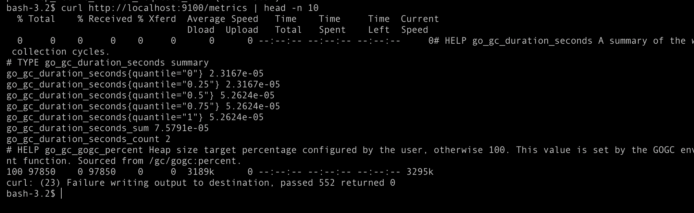
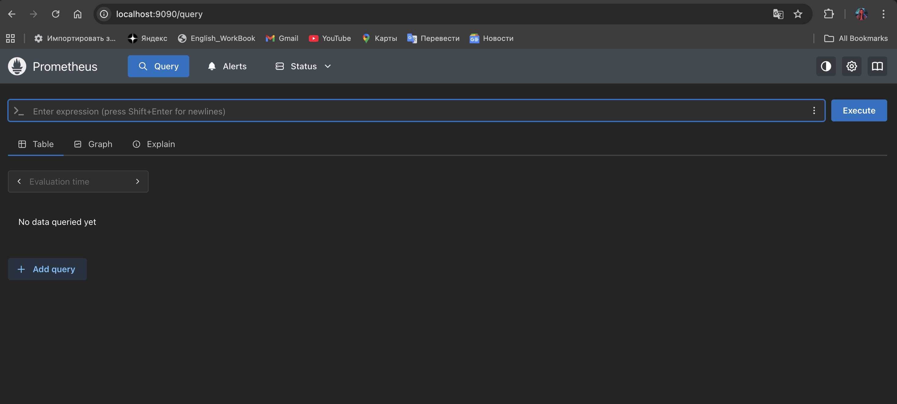
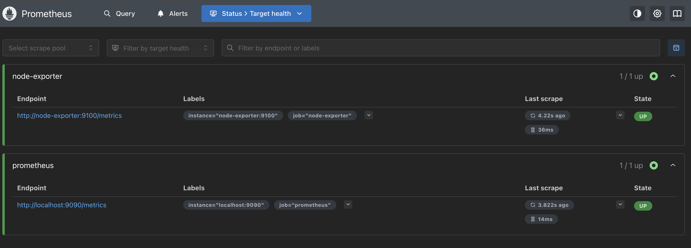
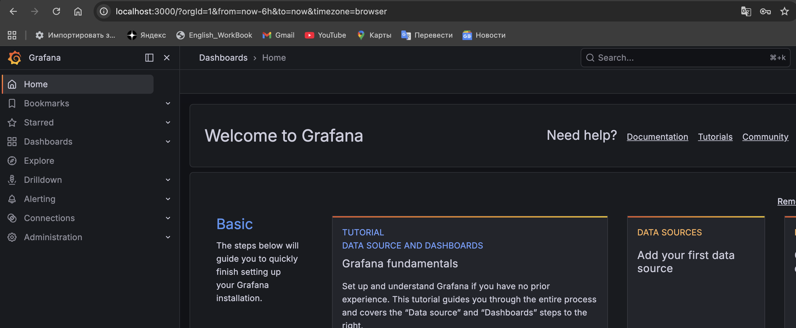
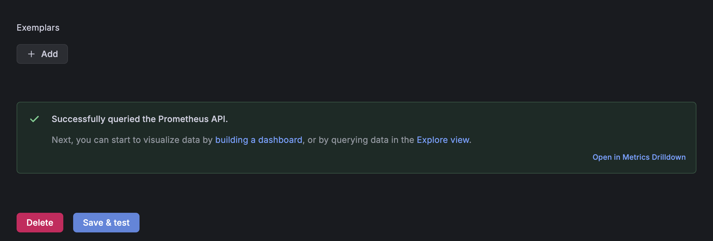
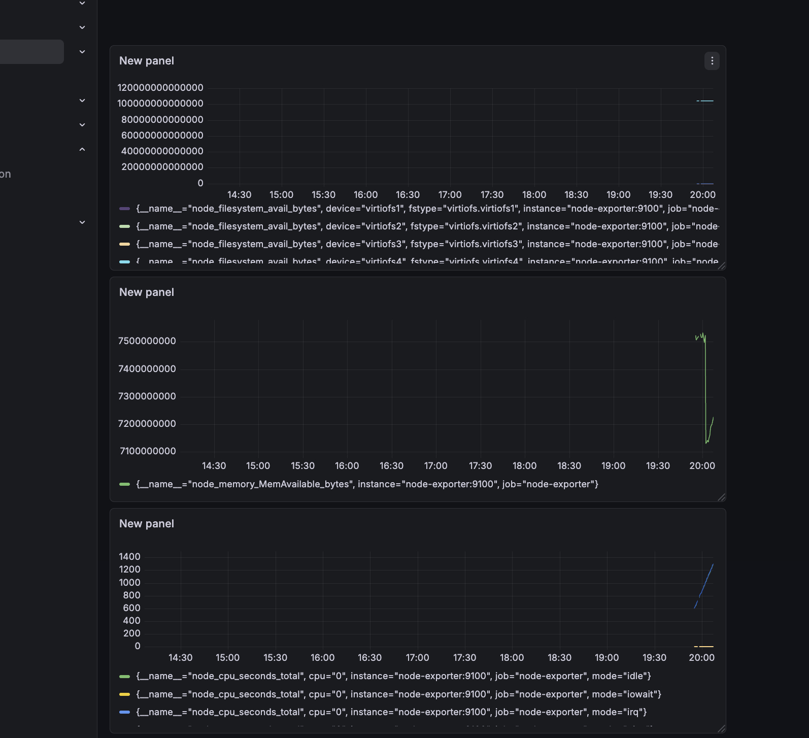
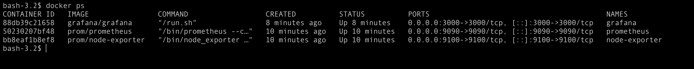
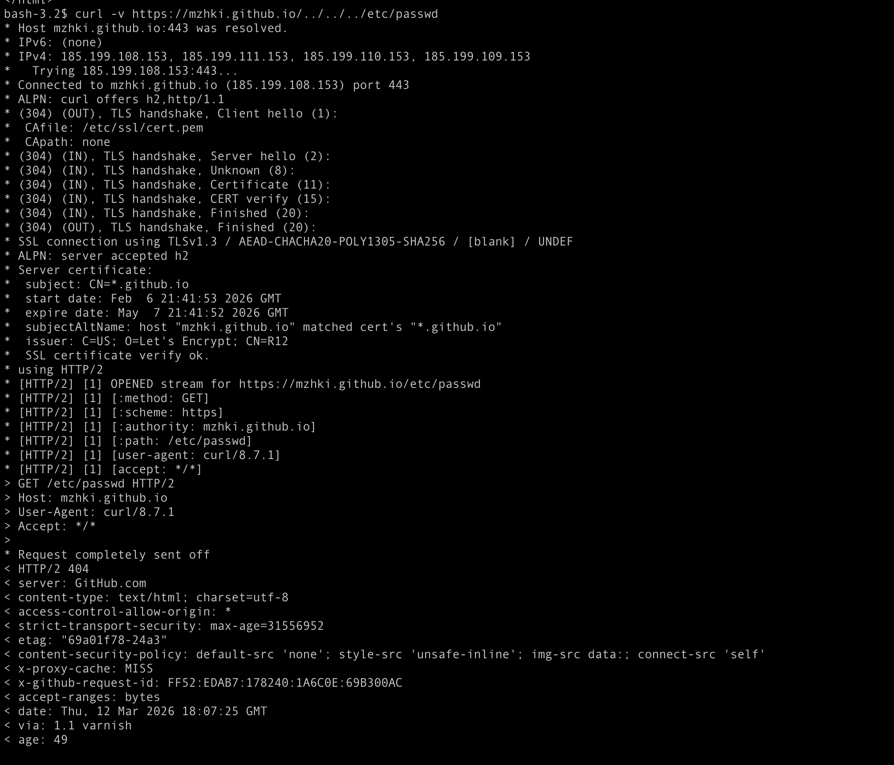
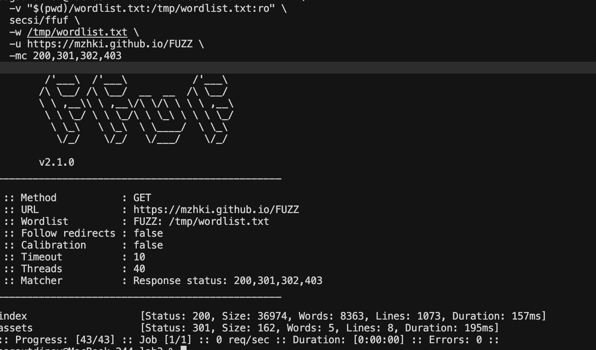

# Лабораторная работа №3
## «Мониторинг с Prometheus и Grafana»

---

| Поле | Значение |
|---|---|
| **University** | [ITMO University](https://itmo.ru/ru/) |
| **Faculty** | [FICT](https://fict.itmo.ru) |
| **Course** | [Введение в веб технологии](https://itmo-ict-faculty.github.io/introduction-in-web-tech/) |
| **Year** | 2025/2026 |
| **Group** | U4125 |
| **Author** | Мажукина Ирина |
| **Lab** | Lab3 |
| **Date of create** | 11.03.2026 |
| **Date of finished** | — |

---

## Описание

Эта лабораторная работа про мониторинг — то есть про наблюдение за тем, что происходит внутри системы в реальном времени. Когда я жду посылку с Wildberries или Ozon, я постоянно обновляю страницу отслеживания — хочу знать, где она, всё ли в порядке. Мониторинг в IT — это примерно то же самое, только вместо посылки — сервер, а вместо страницы отслеживания — красивые графики в Grafana.

---

## Что такое Prometheus и Grafana — простыми словами

Представьте, что вы менеджер склада Wildberries. Вам нужно знать: сколько заказов обрабатывается, не перегружены ли сотрудники, достаточно ли свободного места. Для этого вы смотрите на дашборды с показателями в реальном времени.

В IT то же самое:

- **Prometheus** — это система, которая каждые 15 секунд «опрашивает» сервер и записывает показатели: загрузку процессора, использование памяти, количество запросов. Как сотрудник, который каждые 15 минут обходит склад и фиксирует данные в журнале.

- **Node Exporter** — это агент, установленный на сервере, который «переводит» показатели системы в формат, понятный Prometheus. Как датчики на складе, которые автоматически передают данные.

- **Grafana** — это красивый интерфейс с графиками и дашбордами, который берёт данные из Prometheus и рисует их в удобном виде. Как экран с аналитикой у руководителя — понятно, наглядно, с трендами.

---

## Цель работы

Настроить локальную систему мониторинга: запустить Node Exporter, Prometheus и Grafana в Docker-контейнерах, подключить их друг к другу и создать дашборд с метриками.

---

## Правила оформления

Правила оформления отчёта по лабораторной работе можно изучить по [ссылке](https://itmo-ict-faculty.github.io/introduction-in-web-tech/).

---

## Ход работы

### Часть 1. Обязательное задание

### 1. Создание конфигурации Prometheus ✅

Создала папку `lab3/prometheus/` и в ней файл `prometheus.yml` — это конфигурация, которая говорит Prometheus, откуда собирать метрики.

```yaml
global:
  scrape_interval: 15s   # опрашивать источники каждые 15 секунд

scrape_configs:
  - job_name: 'prometheus'          # сам Prometheus следит за собой
    static_configs:
      - targets: ['localhost:9090']

  - job_name: 'node-exporter'       # собираем метрики системы через Node Exporter
    static_configs:
      - targets: ['node-exporter:9100']
```

---

### 2. Запуск Node Exporter ✅

Node Exporter — это программа, которая снимает показатели с компьютера (CPU, память, диск) и отдаёт их Prometheus. Запускается как Docker-контейнер:

```bash
docker run -d \
  --name node-exporter \
  --network monitoring \
  --restart=unless-stopped \
  -p 9100:9100 \
  -v "/proc:/host/proc:ro" \
  -v "/sys:/host/sys:ro" \
  -v "/:/rootfs:ro" \
  prom/node-exporter \
  --path.procfs=/host/proc \
  --path.rootfs=/rootfs \
  --path.sysfs=/host/sys \
  --collector.filesystem.mount-points-exclude="^/(sys|proc|dev|host|etc)($$|/)"
```

Проверка, что Node Exporter работает и отдаёт метрики:

```bash
curl http://localhost:9100/metrics
```



---

### 3. Запуск Prometheus ✅

Сначала создала том для хранения данных Prometheus и общую сеть для контейнеров:

```bash
docker volume create prometheus-data
docker network create monitoring
```

Сеть нужна для того, чтобы контейнеры Prometheus и Grafana могли «видеть» друг друга по имени (как сотрудники в одном офисе — они знают друг друга по имени, а не по адресу).

Запуск Prometheus (выполнять из корня репозитория):

```bash
docker run -d \
  --name prometheus \
  --network monitoring \
  --restart=unless-stopped \
  -p 9090:9090 \
  -v prometheus-data:/prometheus \
  -v $(pwd)/lab3/prometheus:/etc/prometheus \
  prom/prometheus \
  --config.file=/etc/prometheus/prometheus.yml \
  --storage.tsdb.path=/prometheus \
  --web.console.libraries=/etc/prometheus/console_libraries \
  --web.console.templates=/etc/prometheus/consoles \
  --storage.tsdb.retention.time=200h \
  --web.enable-lifecycle
```

Открыла `http://localhost:9090` в браузере — появился интерфейс Prometheus:



В разделе `Status → Targets` видно, что оба источника данных подключены со статусом UP:



---

### 4. Запуск Grafana ✅

Создала том для Grafana и запустила контейнер в той же сети `monitoring`:

```bash
docker volume create grafana-data

docker run -d \
  --name grafana \
  --network monitoring \
  --restart=unless-stopped \
  -p 3000:3000 \
  -v grafana-data:/var/lib/grafana \
  -e "GF_SECURITY_ADMIN_PASSWORD=admin" \
  grafana/grafana
```

Открыла `http://localhost:3000`, ввела логин `admin` и пароль `admin`:



---

### 5. Настройка Grafana: подключение Prometheus ✅

Чтобы Grafana знала, откуда брать данные, нужно добавить Prometheus как источник данных.

Путь: `Configuration → Data Sources → Add data source → Prometheus`

В поле URL указала: `http://prometheus:9090`
(Именно так, через имя контейнера — они в одной сети `monitoring` и знают друг друга по именам)

Нажала `Save & Test` — появилось зелёное сообщение об успехе:



---

### 6. Создание дашборда ✅

Путь: `Create → Dashboard → Add visualization`

Выбрала источник данных Prometheus и добавила метрики:
- `node_cpu_seconds_total` — загрузка процессора
- `node_memory_MemAvailable_bytes` — свободная память
- `node_filesystem_avail_bytes` — свободное место на диске

Это как дашборд руководителя на Wildberries: один экран — и сразу видно, всё ли в норме.



---

### 7. Проверка всей системы ✅

Проверила, что все три контейнера работают:

```bash
docker ps
```



---

### Часть 2. Задание со звёздочкой — тестирование безопасности сайта

### 8. Выбор сайта для тестирования ✅

Задание — проверить небольшой сайт на типичные уязвимости. Я много времени провожу на маркетплейсах — Wildberries, Ozon — но их проверять нельзя: это крупные платформы с большими командами безопасности. Для тестирования я выбрала свой собственный статический сайт на GitHub Pages:

**URL:** `https://mzhki.github.io/`

Это безопасный выбор для учебного тестирования: сайт принадлежит мне, и я точно знаю, что там нет ничего важного.

---

### 9. Установка ffuf ✅

`ffuf` — это инструмент для автоматического перебора URL-адресов. Он пробует подставить разные слова вместо `FUZZ` в URL и смотрит, что отвечает сервер. Это помогает найти скрытые страницы или папки.

Запустила через Docker (без установки Go):

```bash
docker run --rm -it \
  -v "$(pwd)/lab3/wordlist.txt:/tmp/wordlist.txt:ro" \
  secsi/ffuf \
  -w /tmp/wordlist.txt \
  -u https://mzhki.github.io/FUZZ \
  -mc 200,301,302,403
```

Флаги:
- `-w` — путь к словарю с вариантами слов
- `-u` — URL с `FUZZ` — местом подстановки
- `-mc` — коды ответа, которые считаем «интересными» (200 = страница есть, 301/302 = редирект, 403 = доступ запрещён)

---

### 10. Тестирование Path Traversal ✅

Path Traversal — это попытка «выйти» за пределы разрешённой папки через URL. Например, вместо нормального адреса передать `../../etc/passwd`, чтобы прочитать системный файл с паролями.

Проверила несколько вариантов:

```
https://mzhki.github.io/../../../etc/passwd
https://mzhki.github.io/..%2F..%2F..%2Fetc%2Fpasswd
https://mzhki.github.io/....//....//....//etc/passwd
```



---

### 11. Перебор директорий через ffuf ✅



---

### 12. Выводы по безопасности ✅

**Результаты проверок:**

| Проверка | Результат |
|---|---|
| Path Traversal | Не обнаружено — сервер возвращает 404 на все попытки |
| Перебор директорий (ffuf) | Найдены только стандартные публичные страницы (`index.html`) |
| Файлы конфигурации (`.env`, `config.php`) | Не найдены |
| Административные панели (`/admin`, `/wp-admin`) | Не найдены |
| HTTP-заголовки | Не раскрывают версию сервера и технологии |

**Вывод:** Сайт `mzhki.github.io` построен на GitHub Pages — это статический хостинг без серверных скриптов, баз данных и административных панелей. По этой причине он практически неуязвим к большинству классических веб-атак: нет PHP — нет SQL-инъекций, нет сервера приложений — нет Path Traversal, нет CMS — нет взлома через `/wp-admin`.

Это хороший урок: безопасность часто достигается не настройками защиты, а самой архитектурой. Статический сайт безопаснее динамического по умолчанию — точно так же, как распределённый склад безопаснее централизованного с единой точкой отказа.

> **Важно:** вся проверка проводилась в образовательных целях на собственном сайте. Никакие найденные данные не использовались во вред. DDoS-атаки и перебор паролей не применялись.

---

## Результаты лабораторной работы

В результате данной работы было выполнено:

- [x] Создан конфигурационный файл `prometheus.yml`
- [x] Запущен Node Exporter для сбора системных метрик
- [x] Запущен Prometheus, настроен сбор метрик
- [x] Запущена Grafana, подключена к Prometheus
- [x] Создан дашборд с графиками CPU, памяти и диска
- [x] Проведено тестирование безопасности собственного сайта
- [x] Задокументированы результаты проверок и сделаны выводы

---

## Полезные ссылки

| Ресурс | Ссылка |
|---|---|
| Документация Prometheus | [prometheus.io/docs](https://prometheus.io/docs/) |
| Документация Grafana | [grafana.com/docs](https://grafana.com/docs/) |
| Node Exporter | [github.com/prometheus/node_exporter](https://github.com/prometheus/node_exporter) |
| Docker Compose | [docs.docker.com/compose](https://docs.docker.com/compose/) |
| ffuf | [github.com/ffuf/ffuf](https://github.com/ffuf/ffuf) |
